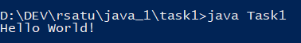
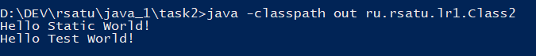

= Отчет по лабораторной работе 1
:listing-caption: Листинг
:source-highlighter: coderay

Студент: Рябков Владислав Алексеевич

Группа: ПИМ-22

== 1. Постановка задачи

В процессе выполнения лабораторной работы необходимо выполнить следующие задачи:

. Создать исполняемый java класс, который выводит текстовую строку на экран
. Разработать два класса. Первый класс вызывает 2 метода из второго класса (статический и нестатический)
. Создать jar-файл, хранящий элементы из предыдущего задания

== 2. Разработка задачи

=== 2.1 Структура проекта

Проект разделен на следующие директории:

1::
Код задачи 1. Исполняемый java класс, который выводит результат работы на экран.

2::

/src:::
Исходный код задачи 2. 2 java класса. Класс Class2.java вызывает 2 метода из класса
Class1.java

/out:::
Скомпилированные классы задачи 2

3::
Содержит manifest.txt и сгенерированный jar файл

result::
Отчет по проделанной работе

== 3. Информация о реализации

=== 3.1 Задание 1

Для выполнения первого задания создан исполняемый класс Task1.

.Код класса Task1

[source,java]
----
public class Task1 {
    public static void main(String[] args) {
        System.out.println("Hello World!");
    }
}
----

Для того, чтобы скомпилировать файл в командной строке использовалась команда javac.

.Команда javac
----
javac Task1.java
----

Для того, чтобы запустить файл в командной строке использовалась команда java.

.Команда java
----
java Task1
----

Результат работы скомпилированного файла.

.Результат работы
----
Hello World!
----

=== 3.2 Задание 2

Для выполнения этого задания было создано 2 класса. Class1 и Class2

.Класс Class1
[source,java]
----
package ru.rsatu.lr1;

public class Class1 {
	
    static String string1 = "Hello";
	
    public static void staticPrint(String name) {
        System.out.println(string1 + " " + name + "!");
    }

    public void print(String name) {
        System.out.println("Hello " + name + "!");
    }
}
----

.Класс Class2
[source,java]
----
package ru.rsatu.lr1;

import ru.rsatu.lr1.Class1;

public class Class2 {
    public static void main(String[] args) {
        Class1.printHello("Static World");

        Class1 class1 = new Class1();
        class1.print("Test World");
    }
}
----

Для компиляции использовались следующие команды:

.Компиляция классов Class1 и Class2
----
javac -classpath out/ -d out/ src/ru/rsatu/lr1/Class1.java
javac -classpath out/ -d out/ src/ru/rsatu/lr1/Class2.java
----

Затем файл Class2 был запущен командой java.

.Запуск класса Class2
----
java -classpath out ru.rsatu.lr1.Class2
----

Получен следующий результат

.Результаты работы класса Class2
----
Hello Static World!
Hello Test World!
----

=== 3.3 Задание 3

Для выполнения третьего задания был создан файл manifest.txt, в котором указан исполняемый класс Class2

.Листинг manifest.txt
[source,java]
----
Manifest-Version: 1.0
Created-By: 1.8.0_281 (Oracle Corporation)
Main-Class: ru.rsatu.lr1.Class2
----

После этого была выполнена команда по сборке архива jar и запуск jar-файла

.Команды по сборке архива и запуску
----
jar cfm result.jar manifest.txt ru/rsatu/lr1/*.class
java -jar result.jar
----

В результате выполнения выводится следующее:

.Результат выполнения
----
Hello Static World!
Hello Test World!
----

== 4. Результаты выполнения

В результате выполнения первого задания был получен класс Task1.
При запуске выводится следующая информация:

В результате выполнения второго задания были получены классы Class1 и Class2.
При запуске класса Class2 выводятся следующая информация:

В результате выполнения третьего задания был получен jar файл result.jar.
При его запуске:

== 5. Вывод

В результате выполнения лабораторной работы получены навыки по написанию базовых Java классов, использованию статических методов и переменных, компиляции, запуску проектов, созданию jar файлов с помощью командной строки.